# Mobile MVP roadmap

Last updated: 2026-10-03. **MONO-001 is in progress (children MONO-001-A to MONO-001-C completed); all other implementation tasks are planned.**

## Milestone order

1. Implement a complete mobile MVP using realistic mocks.
2. Review and stabilize contracts against the working mobile product.
3. Future milestone: implement the backend against those contracts.
4. Future milestone: replace mock transport with HTTP/Socket.IO.

This roadmap covers only items 1–2. No backend implementation or real transport tasks are in the DAG. Completing a task does not authorize starting the next milestone automatically.

## Progress

Documentation baseline **DOC-000**, shared Codex/Claude Code workflow **DOC-001**, and small first-step task plan **DOC-002** are complete. MONO-001 is in progress: **MONO-001-A** recorded the toolchain in [TOOLCHAIN.md](TOOLCHAIN.md), **MONO-001-B** created the root pnpm workspace, and **MONO-001-C** added the empty `@ride-match/contracts` package with a working `pnpm build:contracts`. Lint, typecheck wrappers, and Turbo wiring remain. See [WORK_LOG.md](WORK_LOG.md) for actual changes and verification. The next assignment is **MONO-001-D**, when requested.

Use [FIRST_STEPS.md](FIRST_STEPS.md) to execute MONO-001 and MOBILE-001 as 13 bounded child assignments, one per request. It owns child statuses; this table owns parent statuses. Complete a parent only after all required children and parent criteria pass. The proposed order is workspace -> Expo shell -> separately planned contract work, which preserves the existing dependencies. The 25 parent tasks and their DAG are unchanged.

| ID | Task | Status |
| --- | --- | --- |
| MONO-001 | Workspace foundation | In progress |
| CONTRACT-001 | Common, location, authentication contracts | Planned |
| CONTRACT-002 | Places, rides, matching contracts | Planned |
| CONTRACT-003 | Groups, chat, safety contracts | Planned |
| CONTRACT-004 | Realtime and notification contracts | Planned |
| MOBILE-001 | Expo shell and navigation | Planned |
| DATA-001 | Data-source and Query foundation | Planned |
| MOCK-001 | Simulator foundation | Planned |
| SYNC-001 | Event synchronization and recovery | Planned |
| AUTH-001 | Simulated authentication | Planned |
| LOCATION-001 | Foreground location | Planned |
| MAP-001 | Native map shell | Planned |
| ANALYTICS-001 | Typed analytics foundation | Planned |
| MAP-002 | Live nearby activity | Planned |
| DESTINATION-001 | Destination selection and compatibility | Planned |
| RIDE-001 | Creation, matching, expiration | Planned |
| GROUP-001 | Atomic mock group operations | Planned |
| GROUP-002 | Group product flow | Planned |
| CHAT-001 | Temporary text chat | Planned |
| MEETING-001 | Meeting point and readiness | Planned |
| TAXI-001 | Yandex Go handoff | Planned |
| SAFETY-001 | Block and report | Planned |
| NOTIFICATION-001 | Local notification-driven flows | Planned |
| QA-001 | Integrated MVP verification | Planned |
| HANDOFF-001 | Contract review and backend readiness | Planned |

## Task rules

Each parent task defines a bounded capability for either Codex or Claude Code. It can require several smaller assignments. For Terra, use the explicit child cards in [FIRST_STEPS.md](FIRST_STEPS.md) for the first batch; split later parents similarly before implementation. Implement only requested scope and preserve completed behavior. Read the latest task handoff before resuming another assistant's work.

In task file lists, `M` means `apps/mobile` and `C` means `packages/contracts`. Paths and commands are proposed and do not currently exist. Update them if implementation chooses an equivalent clearer organization.

Every code task runs `pnpm typecheck` and `pnpm lint` in addition to listed checks once those scripts exist. Add meaningful tests for behavior/contract changes, not trivial snapshots. Record unavailable native checks honestly. Documentation-only tasks validate documents instead of pretending to run application checks.

After meaningful work, update affected specifications, this progress table, [WORK_LOG.md](WORK_LOG.md), and [AI_CONTEXT.md](AI_CONTEXT.md). Add useful TSDoc to reusable logic and integration boundaries. Mark completion only when observable acceptance criteria are met.

Use the statuses and attribution procedure in [AI_WORKFLOW.md](AI_WORKFLOW.md): `Planned`, `In progress`, `Paused`, `Blocked`, `Completed`. Active owner/session, working-copy scope, and resume point live in `AI_CONTEXT.md`; detailed attributed handoffs live in `WORK_LOG.md`. A new assistant must verify actual files and unfinished criteria instead of restarting a task based on its title alone.

## MONO-001 — Workspace foundation

Execution: [MONO-001-A through MONO-001-E](FIRST_STEPS.md#task-cards), assigned individually.

- **Goal:** Workspace commands and shared-package builds work.
- **Scope:** pnpm/Turborepo setup, strict TypeScript, contracts package shell, root scripts, README, documentation alignment.
- **Expected files/modules:** Root workspace/task configuration; `C/package.json`, `C/tsconfig.json`; README and existing docs.
- **Dependencies:** None.
- **Acceptance criteria:** Contracts build from the root; package boundaries and script behavior are documented; mobile/API packages are not invented prematurely.
- **Verification:** `pnpm build:contracts`, `pnpm typecheck`, `pnpm lint`; inspect package graph and documented command behavior. Do not introduce meaningless tests to claim a test pass.
- **Non-goals:** Expo app, backend package, remote cache, extra shared packages, unrelated repository cleanup.

## CONTRACT-001 — Common, location, and authentication contracts

- **Goal:** Foundational communication/privacy boundaries are explicit.
- **Scope:** IDs/timestamps, exact/public locations, user projections, OTP/session schemas, error envelopes.
- **Expected files/modules:** `C/src/{common,location,auth,users,errors}.ts`, contract tests; API overview/authentication docs.
- **Dependencies:** MONO-001.
- **Acceptance criteria:** Public schemas reject private fields; invalid location/auth inputs fail predictably; types are inferred from runtime schemas.
- **Verification:** `pnpm test:contracts`; review example payloads for sensitive/private fields.
- **Non-goals:** SMS delivery, token signing, production location obfuscation.

## CONTRACT-002 — Places, rides, and matching contracts

- **Goal:** Discovery and ride-request semantics are specified.
- **Scope:** Places/search, nearby items, public/own requests, lifecycle, supplied match results.
- **Expected files/modules:** `C/src/{places,rides,matches}.ts`, contract tests, `docs/api/rides.md`.
- **Dependencies:** CONTRACT-001.
- **Acceptance criteria:** Anonymous previews, protected creation, expiry, and server-supplied matches are representable without UI fields.
- **Verification:** `pnpm test:contracts`; walk through create -> match -> expire payloads and public projections.
- **Non-goals:** Real geocoding, routes, compatibility algorithms.

## CONTRACT-003 — Groups, chat, and safety contracts

- **Goal:** Collaboration operations have unambiguous contracts.
- **Scope:** Atomic joining, group lifecycle, members, meeting points, text messages, block/report.
- **Expected files/modules:** `C/src/{groups,chat,safety}.ts`, contract tests, `docs/api/groups.md`.
- **Dependencies:** CONTRACT-002.
- **Acceptance criteria:** Solo-to-group formation, last-seat conflict, leave, closure, and access revocation are specified.
- **Verification:** `pnpm test:contracts`; review transition/permission table and request/response examples.
- **Non-goals:** Reputation, media chat, meeting-point optimization.

## CONTRACT-004 — Realtime and notification contracts

- **Goal:** Asynchronous updates share a stable vocabulary.
- **Scope:** Event/notification envelopes, logical subscriptions, audiences, recovery semantics.
- **Expected files/modules:** `C/src/{realtime,notifications}.ts`, contract tests, `docs/api/realtime.md`.
- **Dependencies:** CONTRACT-003.
- **Acceptance criteria:** Each event has a validated payload, audience, and cache/recovery rule; push payloads contain no sensitive content.
- **Verification:** `pnpm test:contracts`; validate public/private event and notification examples.
- **Non-goals:** Socket.IO server/client implementation, remote push delivery.

## MOBILE-001 — Expo shell and navigation

Execution: [MOBILE-001-A through MOBILE-001-H](FIRST_STEPS.md#mobile-001-a--create-the-minimal-expo-router-shell), assigned individually. Early routes are inert placeholders; real authentication, membership, and scenarios remain in their later tasks.

- **Goal:** A development application launches on both platforms.
- **Scope:** Expo Router, native app configuration, basic UI primitives/providers, test harness, route skeletons.
- **Expected files/modules:** `M/app/`, `M/src/bootstrap/`, `M/src/ui/`, app/test configuration.
- **Dependencies:** MONO-001.
- **Acceptance criteria:** Map placeholder and auth modal navigation work; the behavior-test harness runs; dependencies pass Expo checks.
- **Verification:** `pnpm doctor`, `pnpm test:mobile`, `pnpm mobile:android`, `pnpm mobile:ios`; manually open/dismiss auth routes.
- **Non-goals:** Domain data, finished map, large design system.

## DATA-001 — Data-source and Query foundation

- **Goal:** Features can call typed asynchronous operations through one boundary.
- **Scope:** AppDataSource, central selection, Query provider/keys, error normalization, read cancellation, config validation, import restrictions.
- **Expected files/modules:** `M/src/data/`, `M/src/config/`, bootstrap providers.
- **Dependencies:** MOBILE-001, CONTRACT-004.
- **Acceptance criteria:** Features cannot import mock fixtures; unsupported API mode fails clearly; identity/parameters are represented in relevant query keys.
- **Verification:** `pnpm test:mobile --runTestsByPath src/data/dataSource.test.ts`; verify lint restriction with a controlled invalid import test/check.
- **Non-goals:** HTTP implementation, generic dependency-injection framework, multiple repository/service layers.

## MOCK-001 — Simulator foundation

- **Goal:** Deterministic mock operations and timed events work.
- **Scope:** State, injected clock, scheduled events, safe serialization, latency/failure controls, minimal active/empty seeds, reset cleanup.
- **Expected files/modules:** `M/src/data/mock/`, simulator behavior tests.
- **Dependencies:** DATA-001.
- **Acceptance criteria:** Reset is repeatable; timers/listeners do not accumulate; public outputs contain no exact private locations.
- **Verification:** `pnpm test:mobile --runTestsByPath src/data/mock/simulator.test.ts`; repeat resets and advance fake time.
- **Non-goals:** Every product operation, persistent fake database, fake HTTP server.

## SYNC-001 — Event synchronization and recovery

- **Goal:** Query state converges after events and interruptions.
- **Scope:** Subscriptions, invalidation, version guards, deduplication, snapshot/event races, foreground/reconnect recovery.
- **Expected files/modules:** `M/src/data/synchronizeEvents.ts`, lifecycle hooks and synchronization tests.
- **Dependencies:** MOCK-001.
- **Acceptance criteria:** Duplicate/stale/missed events converge to canonical state; session/scenario resets clear subscriptions and protected data.
- **Verification:** `pnpm test:mobile --runTestsByPath src/data/synchronizeEvents.test.ts`; inject duplicate/out-of-order events during reads.
- **Non-goals:** Socket.IO adapter, event-sourced client database, persistent offline mutation queue.

## AUTH-001 — Simulated authentication

- **Goal:** Protected actions authenticate while preserving context.
- **Scope:** Mock OTP/session operations, phone/code screens, bootstrap/refresh/logout, credential boundary, pending-action continuation.
- **Expected files/modules:** `M/src/features/auth/`, storage adapter, mock auth operations.
- **Dependencies:** MOCK-001.
- **Acceptance criteria:** Anonymous browsing remains usable; create/join/send are gated; cancelled auth returns to browsing; refresh failures clear private data.
- **Verification:** `pnpm test:mobile --runTestsByPath src/features/auth/authFlow.test.tsx`; manually verify invalid/expired code, preserved draft, and refresh failure.
- **Non-goals:** Real SMS, production auth, collecting real phone numbers for demos.

## LOCATION-001 — Foreground location

- **Goal:** The app presents honest usable location states.
- **Scope:** Permission, cached/fresh fix, manual fallback, foreground observation, stale/accuracy handling and cleanup.
- **Expected files/modules:** `M/src/platform/location/`, permission UI and tests.
- **Dependencies:** MOBILE-001.
- **Acceptance criteria:** Allow/deny/unavailable/stale/recovery paths work; observation stops in background; a published request is not silently moved.
- **Verification:** `pnpm test:mobile --runTestsByPath src/platform/location/locationLifecycle.test.ts`; device permission/settings/background checks.
- **Non-goals:** Background tracking, real route calculation, automatic ride-origin updates.

## MAP-001 — Native map shell

- **Goal:** Users can view and navigate a map.
- **Scope:** Provider configuration, user dot, camera/recenter, overlays, base sheet interaction.
- **Expected files/modules:** `M/src/features/map/`, app native configuration.
- **Dependencies:** LOCATION-001.
- **Acceptance criteria:** Basemap/recenter work on both platforms; denied location still permits browsing; local coverage is checked.
- **Verification:** `pnpm mobile:android`, `pnpm mobile:ios`; manually pan/zoom/recenter and deny location.
- **Non-goals:** Nearby domain activity, match highlighting, map-provider abstraction framework.

## ANALYTICS-001 — Typed analytics foundation

- **Goal:** Product actions emit defined inspectable events.
- **Scope:** Event/property schemas, session/dwell semantics, memory/no-op sink, privacy guards, demo labeling.
- **Expected files/modules:** `M/src/analytics/`, behavior tests, analytics section in development docs.
- **Dependencies:** MOBILE-001.
- **Acceptance criteria:** Intent and success events are distinct; sensitive properties are rejected; mock events can be excluded from real metrics.
- **Verification:** `pnpm test:mobile --runTestsByPath src/analytics/analytics.test.ts`; inspect safe event output.
- **Non-goals:** Vendor integration, dashboards, real retention claims.

## MAP-002 — Live nearby activity

- **Goal:** Anonymous users can inspect realistic nearby intentions.
- **Scope:** Nearby reads, public previews, markers/selection/sheets, clustering, empty/stale states, exposure events.
- **Expected files/modules:** Map feature, mock nearby operations, scenarios A/B/M.
- **Dependencies:** MAP-001, SYNC-001, ANALYTICS-001.
- **Acceptance criteria:** Active/empty scenarios work; markers appear/remove without camera jumps; groups do not duplicate solo members; selection stays coherent.
- **Verification:** `pnpm test:mobile --runTestsByPath src/features/map/nearbyMap.test.tsx`; manually run A/B/M and inspect accessibility.
- **Non-goals:** Create/join operations, production matching.

## DESTINATION-001 — Destination selection and compatibility

- **Goal:** Destination choice changes map emphasis.
- **Scope:** Curated place search, sheet, debounce/cancellation, fixture preview matches, clear selection.
- **Expected files/modules:** `M/src/features/destinations/`, mock place/match operations, map selectors.
- **Dependencies:** MAP-002.
- **Acceptance criteria:** Compatible activity is emphasized without hiding the map; unrelated activity remains; clearing selection restores general browsing.
- **Verification:** `pnpm test:mobile --runTestsByPath src/features/destinations/destinationFlow.test.tsx`; rapidly change searches/destinations to check stale reads.
- **Non-goals:** Real geocoder, paid places service, mobile compatibility calculation.

## RIDE-001 — Creation, matching, and expiration

- **Goal:** Users can publish and manage a ride intention.
- **Scope:** Authenticated create/cancel, departure choices, one-live-request invariant, supplied match arrival, expiry and retry behavior.
- **Expected files/modules:** `M/src/features/rides/`, mock ride operations, scenarios C/F.
- **Dependencies:** DESTINATION-001, AUTH-001.
- **Acceptance criteria:** Create -> searching -> match and create -> expired both work; retries do not duplicate; auth preserves the draft.
- **Verification:** `pnpm test:mobile --runTestsByPath src/features/rides/rideFlow.test.tsx`; manually background across expiry and cancel an active request.
- **Non-goals:** Recurring commuting, long-term scheduling, editing published routes.

## GROUP-001 — Atomic mock group operations

- **Goal:** Group invariants work independently of UI.
- **Scope:** Join solo/group, canonical target resolution, capacity, idempotency, leave, coordinator transfer, lifecycle and expiry.
- **Expected files/modules:** Mock group operation modules and transition tests.
- **Dependencies:** MOCK-001.
- **Acceptance criteria:** Concurrent joins cannot exceed four or create duplicate target groups; leaves/transfers/expiry follow documented rules.
- **Verification:** `pnpm test:mobile --runTestsByPath src/data/mock/groups.test.ts`; simulate simultaneous last-seat and first-group joins with fake time.
- **Non-goals:** Group screens, backend transactions/distributed locks.

## GROUP-002 — Group product flow

- **Goal:** Users can join, inspect, leave, and manage groups.
- **Scope:** Public preview/join confirmation, member/seat display, group routes, readiness/completion controls, conflict recovery.
- **Expected files/modules:** `M/src/features/groups/`, routes, scenarios D/E.
- **Dependencies:** GROUP-001, RIDE-001.
- **Acceptance criteria:** Solo joining forms a group; capacity conflicts show canonical state; leave updates map/access. Readiness UI can use a supplied mock meeting point until MEETING-001 adds its full display.
- **Verification:** `pnpm test:mobile --runTestsByPath src/features/groups/groupFlow.test.tsx`; manual D/E plus leave and coordinator transfer.
- **Non-goals:** Invitations, approval queues, multi-seat members, optimized meeting points.

## CHAT-001 — Temporary text chat

- **Goal:** Authorized members can exchange text.
- **Scope:** History pagination, composer, canonical send, pending/failed presentation, simulated replies, retry/deduplication, sequence catch-up.
- **Expected files/modules:** `M/src/features/chat/`, mock chat operations, route, scenario H.
- **Dependencies:** GROUP-002.
- **Acceptance criteria:** Retry yields one message; missing messages recover; leaving revokes access; closure disables sending.
- **Verification:** `pnpm test:mobile --runTestsByPath src/features/chat/chatFlow.test.tsx`; native keyboard/sheet checks on both platforms.
- **Non-goals:** Media/files, editing, reactions, threads, typing, read receipts.

## MEETING-001 — Meeting point and readiness

- **Goal:** Members can inspect a shared pickup point and prepare to leave.
- **Scope:** Mock point assignment/update, member-only map landmark/detail, supplied walking estimate, readiness prerequisite integration.
- **Expected files/modules:** Group/map meeting-point components, mock group scenarios.
- **Dependencies:** GROUP-002.
- **Acceptance criteria:** Point changes synchronize; authorized members see it; readiness works when prerequisites are met.
- **Verification:** `pnpm test:mobile --runTestsByPath src/features/groups/meetingPoint.test.tsx`; inspect landmark/distance and mark ready on device.
- **Non-goals:** Optimization, turn-by-turn walking routes, collaborative point editing.

## TAXI-001 — Yandex Go handoff

- **Goal:** Ready groups can open the external taxi provider.
- **Scope:** Small taxi boundary, reviewed parameter validation, link generation/opening, fallback, intent/handoff analytics.
- **Expected files/modules:** `M/src/platform/taxi/`, group CTA, scenario L.
- **Dependencies:** MEETING-001.
- **Acceptance criteria:** Installed and absent-provider paths work; link handoff never automatically completes the group; links/coordinates are not logged.
- **Verification:** `pnpm test:mobile --runTestsByPath src/platform/taxi/yandex.test.ts`; device checks with and without Yandex Go on both platforms.
- **Non-goals:** Booking APIs, fares, payments, multiple providers.

## SAFETY-001 — Block and report

- **Goal:** Users can complete mocked safety flows with real state effects.
- **Scope:** Report receipt/errors, block/unblock, block-and-leave, filtering, membership/cache/subscription cleanup.
- **Expected files/modules:** `M/src/features/safety/`, mock safety operations, scenario J.
- **Dependencies:** GROUP-002, CHAT-001.
- **Acceptance criteria:** Block changes pairing eligibility and shared-group access; old events cannot restore chat; report acceptance/failure is clear.
- **Verification:** `pnpm test:mobile --runTestsByPath src/features/safety/safetyFlow.test.tsx`; manual report/block/leave/unblock sequence.
- **Non-goals:** Moderation service/dashboard, reputation, claims of real enforcement.

## NOTIFICATION-001 — Local notification-driven flows

- **Goal:** Notification entry works without a push backend.
- **Scope:** Contextual permission, local notifications, validated payloads, tap deduplication, cold/warm navigation, mock registration.
- **Expected files/modules:** `M/src/platform/notifications/`, mock devices, scenario K.
- **Dependencies:** CHAT-001, MEETING-001.
- **Acceptance criteria:** Match/member/ready/message notifications resolve current authorized state; stale or denied targets fail gracefully.
- **Verification:** `pnpm test:mobile --runTestsByPath src/platform/notifications/notificationFlow.test.tsx`; development-build device checks for permission denial and warm/cold entry.
- **Non-goals:** Remote push delivery, real backend registration, production push credentials, background location.

## QA-001 — Integrated MVP verification

- **Goal:** Complete mock product is demonstrable and resilient.
- **Scope:** Remaining scenarios, focused Maestro flows, both-platform checks, density/accessibility, timer/listener cleanup, analytics verification.
- **Expected files/modules:** `M/.maestro/`, integration tests/scenarios, development and scenario docs.
- **Dependencies:** TAXI-001, SAFETY-001, NOTIFICATION-001.
- **Acceptance criteria:** [MVP completion criteria](DEVELOPMENT.md#mobile-mvp-completion-criteria) pass; outstanding native/product limitations are recorded accurately.
- **Verification:** `pnpm typecheck`, `pnpm lint`, `pnpm test`, `pnpm doctor`, `pnpm export:android`, `pnpm export:ios`, `pnpm test:e2e`; complete manual A–N matrix and device handoff checks.
- **Non-goals:** Store release, production load tests, backend development.

## HANDOFF-001 — Contract review and backend readiness

- **Goal:** Reviewed mobile behavior provides a concrete future backend specification.
- **Scope:** Reconcile schemas, operations, endpoints/events, errors, privacy, scenarios, implementation limitations, and roadmap state.
- **Expected files/modules:** `C/src/`, API docs, architecture/development/roadmap/context/work log.
- **Dependencies:** QA-001.
- **Acceptance criteria:** Every data-source method maps to a documented endpoint/event; no mock-only assumptions leak into features; [handoff artifacts](api/overview.md#backend-handoff-readiness) are complete.
- **Verification:** `pnpm test:contracts`, `pnpm typecheck`; operation/spec audit and complete demonstration. Run additional relevant tests if review changes behavior.
- **Non-goals:** Populating `apps/api`, implementing HTTP/Socket.IO transport, automatically starting the next milestone.

## Dependency graph

```mermaid
flowchart TD
    MONO["MONO-001"] --> C1["CONTRACT-001"]
    C1 --> C2["CONTRACT-002"]
    C2 --> C3["CONTRACT-003"]
    C3 --> C4["CONTRACT-004"]
    MONO --> MOBILE["MOBILE-001"]
    MOBILE --> LOCATION["LOCATION-001"]
    LOCATION --> MAP1["MAP-001"]
    MOBILE --> ANALYTICS["ANALYTICS-001"]
    MOBILE --> DATA["DATA-001"]
    C4 --> DATA
    DATA --> MOCK["MOCK-001"]
    MOCK --> SYNC["SYNC-001"]
    MOCK --> AUTH["AUTH-001"]
    MOCK --> GROUP1["GROUP-001"]
    MAP1 --> MAP2["MAP-002"]
    SYNC --> MAP2
    ANALYTICS --> MAP2
    MAP2 --> DEST["DESTINATION-001"]
    DEST --> RIDE["RIDE-001"]
    AUTH --> RIDE
    RIDE --> GROUP2["GROUP-002"]
    GROUP1 --> GROUP2
    GROUP2 --> CHAT["CHAT-001"]
    GROUP2 --> MEETING["MEETING-001"]
    MEETING --> TAXI["TAXI-001"]
    CHAT --> SAFETY["SAFETY-001"]
    GROUP2 --> SAFETY
    CHAT --> NOTIFICATIONS["NOTIFICATION-001"]
    MEETING --> NOTIFICATIONS
    TAXI --> QA["QA-001"]
    SAFETY --> QA
    NOTIFICATIONS --> QA
    QA --> HANDOFF["HANDOFF-001"]
```

## Potential parallel work

- After MONO-001: contracts and Expo shell.
- After MOBILE-001: location/map infrastructure and analytics while contracts mature.
- After MOCK-001: auth, synchronization, and atomic group operations.
- After GROUP-002: chat and meeting-point UI.
- Once prerequisites hold: taxi, safety, and notifications.

Sequential implementation remains the default, including when alternating Codex and Claude Code. Follow [shared ownership and handoff rules](AI_WORKFLOW.md#safe-use-of-both-tools) for concurrent work; coordinate shared schemas, composition, lockfiles, and documentation. This graph is not authorization to spawn agents or implement future tasks.
